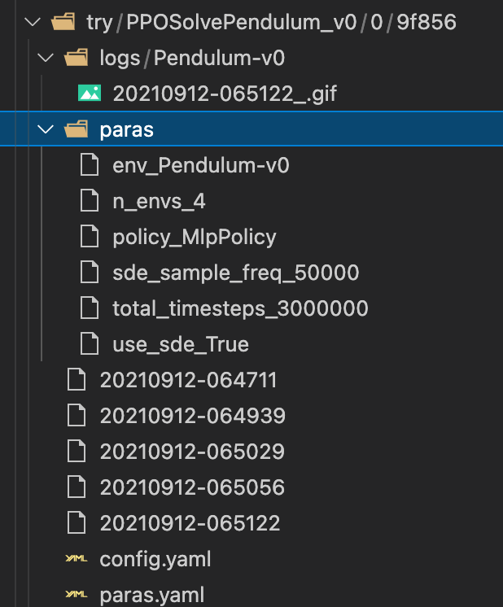
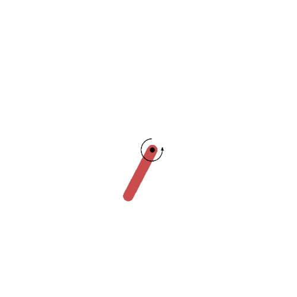
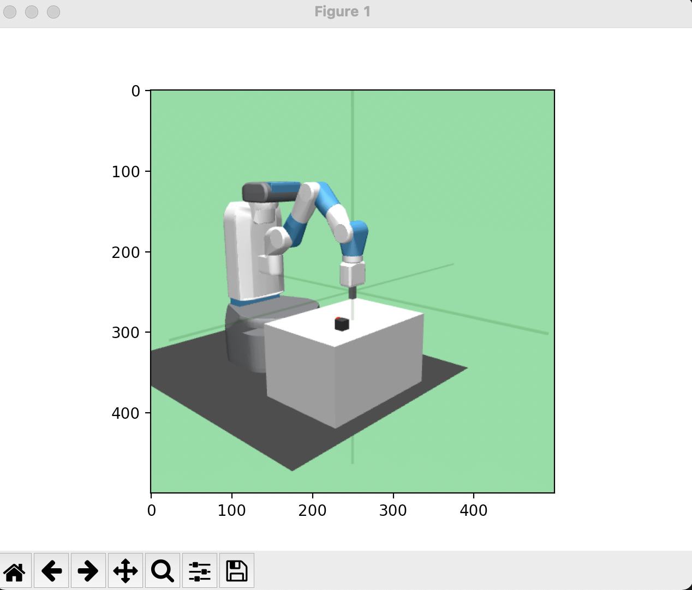

# rl_helper
A few easy to use helper tools for your RL related works.

## Tools we have
- Experiment Manager
- GIF Recorder
- FPS
- Keyboard Interactor

## Install

    pip install rl-helper

# Tools

## Experiment Manager
help you to better organize your experiments.

Example. [See Here](tests/exp_manager.py)

        model_name="ppo"
        exp_class="try"
        exp_target="PPOSolvePendulum_v0"
        comments="show ppo with sde can solve pendulum"
        sub_id=0
        e=ExperimentManager()
        e.init(model_name=model_name,exp_target=exp_target,comments=comments,exp_class=exp_class,sub_id=sub_id)
        e.add_para("n_envs",4)
        e.add_para('env',"Pendulum-v0")
        e.add_para('use_sde',True)
        e.add_para('sde_sample_freq',50000)
        e.add_para('total_timesteps',3000000)
        e.add_para("policy","MlpPolicy")
        e.start(overwrite=True)

        print(e.model_save_pth)

folder strucutre follows 4 layers.
    
    runs/ 

    -->
    exp_class
    (What kind of experiments, eg. Play, Try, Debug, Ablation, Verify ...)

    -->
    experiment_target/ 
    (why do you this experiment, eg. SolvePendulumUsePPO/)
    
    -->
    subid/
    (you may do multiple experiments for the same target)

    -->
    9f856/
    each experiment will have a hash id.

-----

## GIF recorder

It helps you record your gym into gif. See the example [tests/play_gym.py](tests/play_gym.py).

    import gym
    from rl_helper import envhelper

    env = gym.make('CartPole-v1')
    gym_env_helper=envhelper()  # * 1. Init your env helper

    for episode in range(2): 
        obs = env.reset()
        for step in range(30):
            action = env.action_space.sample()  
            action = policy(observation)
            nobs, reward, done, info = env.step(action)
            if done:
                break
            gym_env_helper.recording(env) # * 2. Record the frame
        env.close()

    gym_env_helper.save_gif(times=3) # * 3. Save to gif

Find the GIF in the folder [runs / EnvID / YYYYMMDD-HrMinSc.gif](runs/)

 

------

## FPS test

    env = gym.make('Pendulum-v0')
    env.reset()
    fps(env)

------

## Keyboard Interactor

    import gym
    from rl_helper.keyboard import kbinteractor
    interactor=kbinteractor(env=gym.make('FetchPickAndPlaceDense-v1'),
            key2action={
                    'right':[1,0,0,0],
                    'left':[-1,0,0,0],
                    'up':[0,1,0,0],
                    'down':[0,-1,0,0],
                    "y":[0,0,1,0],
                    "h":[0,0,-1,0],
                    "n":[0,0,0,1],
                    "b":[0,0,0,-1],
                })

 