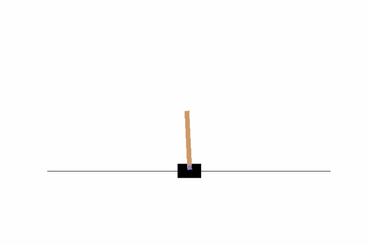

# rl_helper
A few easy to use helper tools for your RL related works.

## Install

    pip install rl-helper

# Tools

## 1. Gym Env Helper (GIF gym recorder)

It helps you record your gym into gif. See the example [tests/play_gym.py](tests/play_gym.py).

    import gym
    from rl_helper import envhelper

    env = gym.make('CartPole-v1')
    gym_env_helper=envhelper()  # * 1. Init your env helper

    for episode in range(2): 
        obs = env.reset()
        for step in range(30):
            action = env.action_space.sample()  
            action = policy(observation)
            nobs, reward, done, info = env.step(action)
            if done:
                break
            gym_env_helper.recording(env) # * 2. Record the frame
        env.close()

    gym_env_helper.save_gif(times=3) # * 3. Save to gif

Find the GIF in the folder [runs / EnvID / YYYYMMDD-HrMinSc.gif](runs/)

